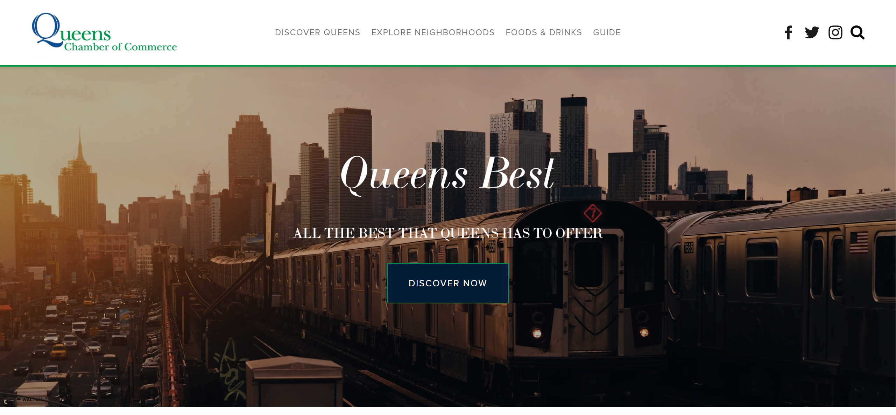
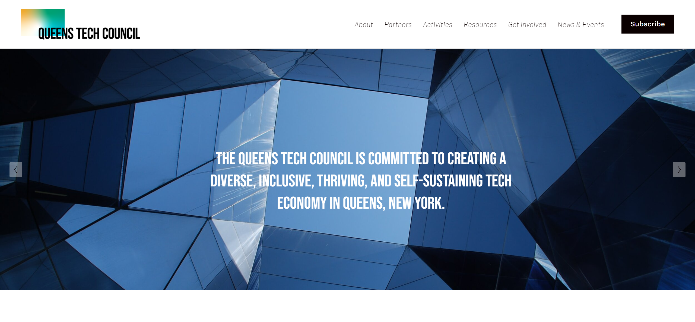

### Hi there 👋
- 🔭 I'm currently working on **completing my Bachelor of Science in Computer Science**.
- 🌱 I'm currently learning:
  - **Discrete Mathematics** and **Calculus** at [City University of New York, Queens College](https://www.cs.qc.cuny.edu/index.html);
  - **Front-End Development** at [Kenzie Academy](https://go.kenzie.academy/amazon/);
  - **Back-End Development with Node.js** on my weekends.
- 🤔 I'm looking for help with **researching Computer Science research areas**.
- 📫 How to reach me:
  - [LinkedIn](https://www.linkedin.com/in/tonychuaco/).
- 😄 Pronouns: **he/him/his**.
- ⚡ Fun fact:
  - Interests in learning more about **Mathematics and Computing Science**.

### Past Projects
#### :star: Penn & Fletcher website @[PennAndFletcher.com](https://www.pennandfletcher.com/)
<a href="https://www.pennandfletcher.com/" target="_blank" rel="noopener noreferrer"><kbd></kbd></a> 
 

#### :star: QueensBest.org website @[QueensBest.org](https://www.queensbest.org/)
<a href="https://www.queensbest.org/" target="_blank" rel="noopener noreferrer"><kbd></kbd></a> 
 

#### :star: Queens Tech Council website @[QueensTechCouncil.com](https://www.queenstechcouncil.com/)
<a href="https://www.queenstechcouncil.com/" target="_blank" rel="noopener noreferrer"><kbd></kbd></a> 
 

<!--
**tonychuaco/tonychuaco** is a ✨ _special_ ✨ repository because its `README.md` (this file) appears on your GitHub profile.

Here are some ideas to get you started:

- 👯 I’m looking to collaborate on ...
- 💬 Ask me about ...
-->
